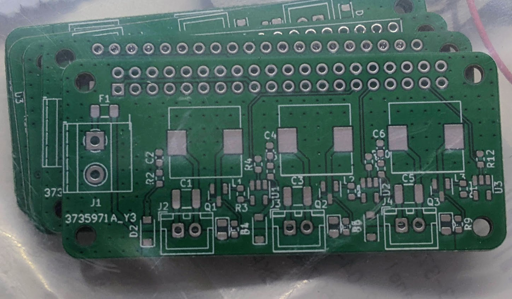
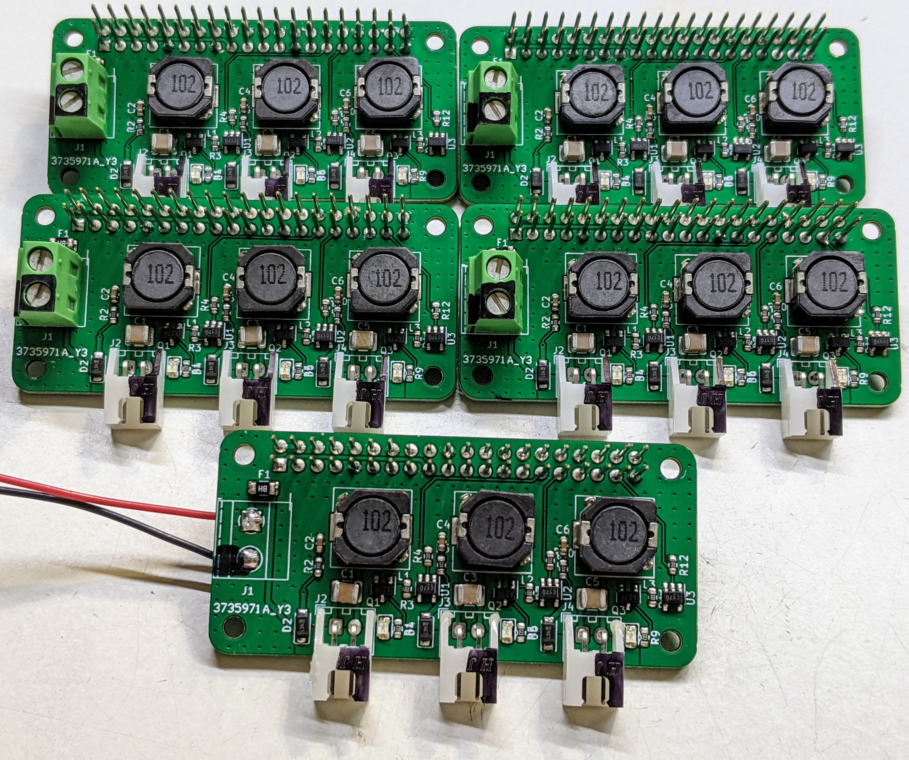

# Silent Fan Zero HAT
## A PWM to DC voltage conversion in HAT form factor

This board is based on the work of Róbert Lőrincz, from Transylvania, Romania (yes, from the place of Dracula). You can see the original board [here](https://orbiterprojects.com/silent-fan-driver/).

The main purpose of this board is to transform a PWM signal into a DC voltage, with benefits being:
* Lower fan noise;
* Better speed control;
* Longer fan lifetime;
* Lower fan vibrations.

Also, you (theoretically) can control lower voltage fans with this board by setting the maximum fan speed to lower values: using a 24V power supply, you'd use a maximum fan speed of 50% for a 12V fan, and 20% for a 5V fan.

(Photos courtesy of Infinite Entropy, from Voron Discord server)

### UPDATES:

May 4th, 2022: Initial public release (on Star Wars Day! May the Fourth be with you!). I had to reupload many files due to the fact that the pre-release version had messed up silkscreen. 🙃
